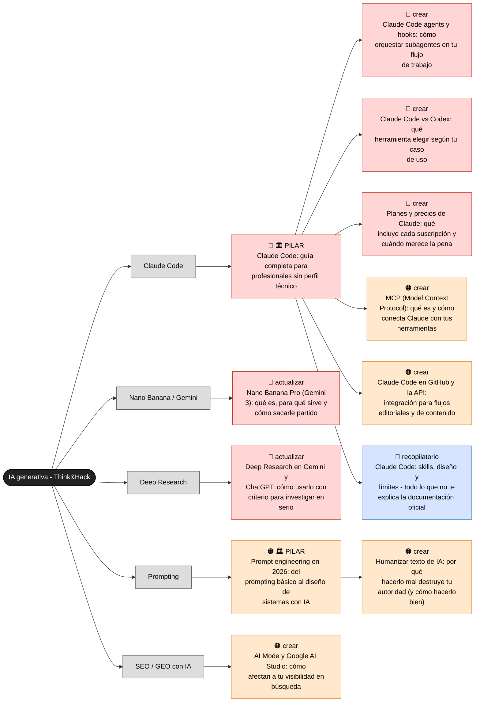

# Topical Map — Think&Hack

> tema -> cluster -> 🏛️ pilar -> satélites. 🔴 alta · 🟠 media · 🔵 baja.

```mermaid
graph LR
  root(["IA generativa - Think&Hack"])
  c0["Claude Code"]
  root --> c0
  c0_p0["🔴 🏛️ PILAR<br/>Claude Code: guía completa para<br/>profesionales sin perfil técnico"]
  c0 --> c0_p0
  c0_s0["🔴 crear<br/>Claude Code agents y hooks: cómo<br/>orquestar subagentes en tu flujo<br/>de trabajo"]
  c0_p0 --> c0_s0
  c0_s1["🔴 crear<br/>Claude Code vs Codex: qué<br/>herramienta elegir según tu caso<br/>de uso"]
  c0_p0 --> c0_s1
  c0_s2["🔴 crear<br/>Planes y precios de Claude: qué<br/>incluye cada suscripción y<br/>cuándo merece la pena"]
  c0_p0 --> c0_s2
  c0_s3["🟠 crear<br/>MCP #40;Model Context<br/>Protocol#41;: qué es y cómo<br/>conecta Claude con tus<br/>herramientas"]
  c0_p0 --> c0_s3
  c0_s4["🟠 crear<br/>Claude Code en GitHub y la API:<br/>integración para flujos<br/>editoriales y de contenido"]
  c0_p0 --> c0_s4
  c0_s5["🔵 recopilatorio<br/>Claude Code: skills, diseño y<br/>límites - todo lo que no te<br/>explica la documentación oficial"]
  c0_p0 --> c0_s5
  c1["Nano Banana / Gemini"]
  root --> c1
  c1_s0["🔴 actualizar<br/>Nano Banana Pro #40;Gemini<br/>3#41;: qué es, para qué sirve y<br/>cómo sacarle partido"]
  c1 --> c1_s0
  c2["Deep Research"]
  root --> c2
  c2_s0["🔴 actualizar<br/>Deep Research en Gemini y<br/>ChatGPT: cómo usarlo con<br/>criterio para investigar en<br/>serio"]
  c2 --> c2_s0
  c3["Prompting"]
  root --> c3
  c3_p0["🟠 🏛️ PILAR<br/>Prompt engineering en 2026: del<br/>prompting básico al diseño de<br/>sistemas con IA"]
  c3 --> c3_p0
  c3_s0["🟠 crear<br/>Humanizar texto de IA: por qué<br/>hacerlo mal destruye tu<br/>autoridad #40;y cómo hacerlo<br/>bien#41;"]
  c3_p0 --> c3_s0
  c4["SEO / GEO con IA"]
  root --> c4
  c4_s0["🟠 crear<br/>AI Mode y Google AI Studio: cómo<br/>afectan a tu visibilidad en<br/>búsqueda"]
  c4 --> c4_s0
  classDef alta fill:#ffd5d5,stroke:#c0392b,color:#000
  classDef media fill:#ffe8cc,stroke:#e67e22,color:#000
  classDef baja fill:#d6e4ff,stroke:#2980b9,color:#000
  classDef cluster fill:#dddddd,stroke:#555,color:#000
  classDef tema fill:#222222,stroke:#000,color:#fff
  class root tema
  class c0,c1,c2,c3,c4 cluster
  class c0_p0,c0_s0,c0_s1,c0_s2,c1_s0,c2_s0 alta
  class c0_s3,c0_s4,c3_p0,c3_s0,c4_s0 media
  class c0_s5 baja
```